# Vigil

> **The autonomous meta-agent that plans, coordinates, and adapts across a dynamic fleet of AI agents.**

Vigil is an AI agent orchestration and developer infrastructure platform for building, running, observing, and extending multi-agent systems.

Rather than hard-coding fixed workflows, Vigil accepts a high-level goal, determines the capabilities required, resolves those capabilities against a dynamic agent registry, executes the resulting dependency graph, observes the outputs, evaluates whether the goal was actually satisfied, and replans when necessary.

The core architectural idea is:

> **The LLM decides what capability is needed. Vigil deterministically decides which registered agent can provide it.**

That separation keeps planning agentic while keeping execution grounded in the real registry, permissions, schemas, and runtime state.

---

## Live Deployment

### Web App

**https://vigil-sdk.vercel.app**

### Google Cloud Backend

**https://vigil-api-805020438187.asia-south1.run.app**

Health endpoint:

```http
GET /health
```

The backend API runs on **Google Cloud Run**, while background agent execution runs through a **Google Cloud Run Worker Pool**.

---

## What Vigil Does

A typical agent workflow is usually predetermined:

```text
Agent A → Agent B → Agent C
```

Vigil instead treats orchestration itself as an agentic problem:

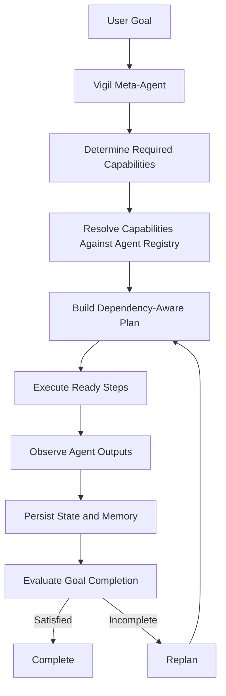

Vigil can:

- understand high-level goals,
- determine required capabilities,
- dynamically resolve agents,
- build dependency-aware execution plans,
- execute independent tasks concurrently,
- persist orchestration state,
- observe and trace agent execution,
- evaluate result quality,
- replan when the result is incomplete,
- reuse successful results across iterations,
- recover interrupted orchestrations,
- enforce runtime permissions,
- stream execution events live,
- expose the platform through a JavaScript/TypeScript SDK.

---

# System Architecture

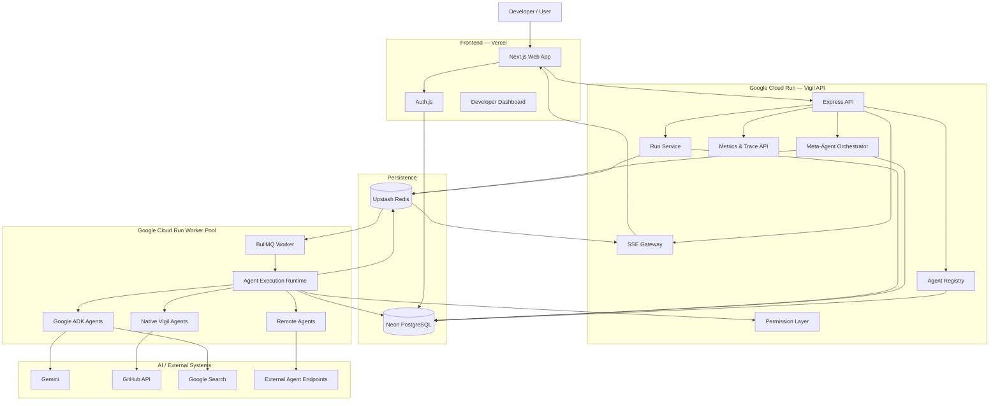

---
## Reproducible Testing

### Option 1 — Test the deployed application

1. Open the deployed Vigil web app.
2. Sign in using Google or GitHub.
3. Navigate to Agents.
4. Open the Google Search Researcher to test the Google ADK integration.
5. Provide a research query and start the run.
6. Inspect the live execution events and persisted trace.
7. Navigate to Runs to inspect execution status, latency, events, and results.
8. Navigate to Orchestrations and submit a higher-level goal.
9. Observe Vigil:
   - plan required capabilities,
   - resolve those capabilities against registered agents,
   - execute the selected agents,
   - observe their outputs,
   - evaluate goal completion,
   - replan if required.

### Expected behavior

Vigil should never rely on an LLM-generated agent identifier.

The planner determines the capability required, while the deterministic runtime resolves that capability against agents actually present in the registry.

The Google Search Researcher is executed using Google ADK.

### Health check

The deployed backend can be verified with:

GET /health

Expected result: a successful API health response.


# Core Architecture Principles

## 1. Capability-First Planning

The planner does not invent arbitrary agent identifiers.

It reasons in terms of capabilities:

```text
web-research
code-review
security-review
```

The runtime then resolves those capabilities against agents that actually exist.

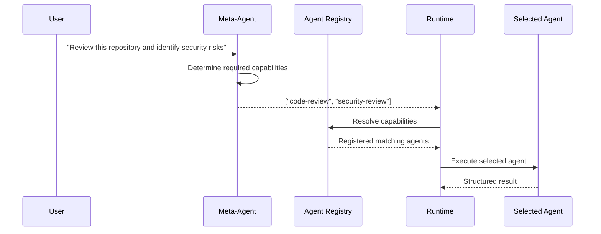

This prevents the planner from bypassing the platform's real registry.

---

## 2. Meta-Agent + Deterministic Runtime

Vigil deliberately separates reasoning from runtime control.

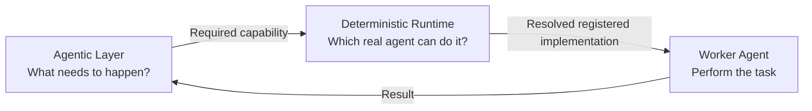

The meta-agent handles:

- planning,
- observation,
- evaluation,
- replanning.

The runtime handles:

- registry lookup,
- schema validation,
- permissions,
- dependencies,
- queueing,
- persistence,
- retries,
- tracing,
- recovery.

---

# Autonomous Orchestration Lifecycle

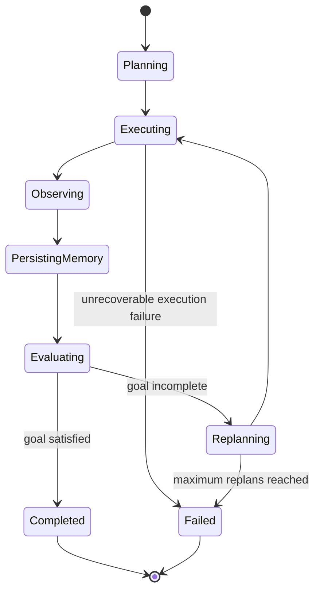

The core loop is:

```text
PLAN
  ↓
EXECUTE
  ↓
OBSERVE
  ↓
PERSIST MEMORY
  ↓
EVALUATE
  ↓
COMPLETE
   or
REPLAN
```

---

# Dependency-Aware Execution

Orchestration steps can depend on previous results.

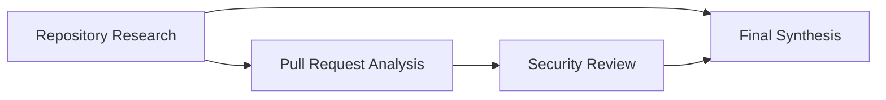

Vigil schedules only steps whose dependencies are satisfied.

Independent steps can execute concurrently.

---

# Cross-Iteration Result Reuse

Successful work does not need to be repeated when Vigil replans.

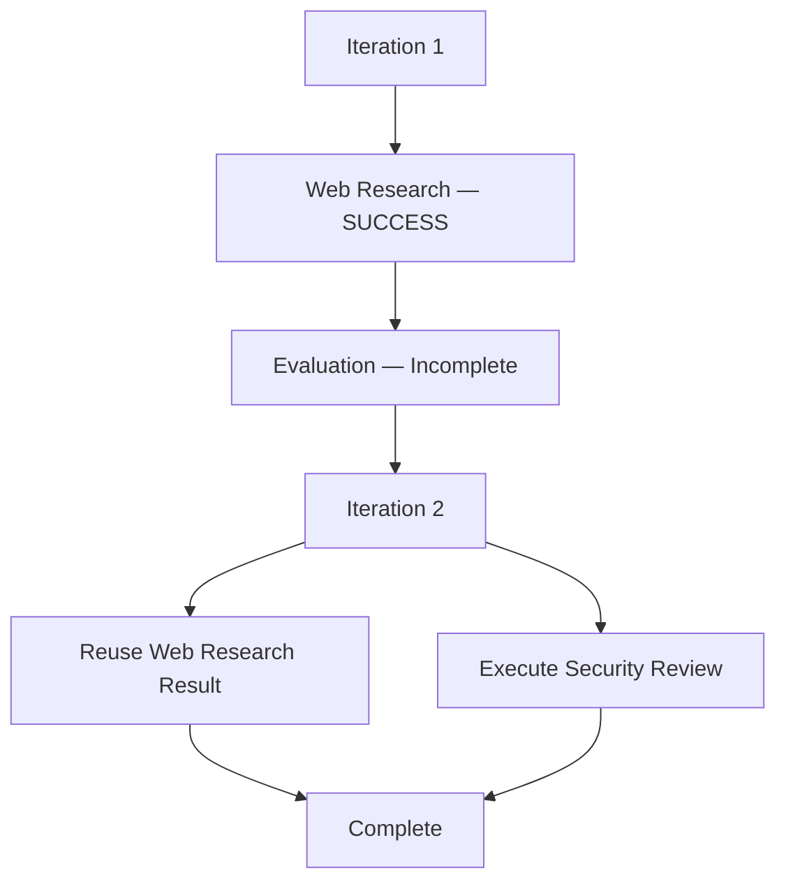

This reduces:

- duplicated agent work,
- latency,
- token usage,
- unnecessary external calls.

---

# Dynamic Agent Registry

Agents are registered as structured platform entities rather than hard-coded functions.

Example metadata:

```ts
{
  slug: "github-reviewer",
  name: "GitHub Reviewer",
  description: "Reviews GitHub pull requests for bugs and code quality issues",
  version: "1.0.0",

  capabilities: [
    "code-review",
    "bug-detection"
  ],

  tools: [
    "github.getPullRequest"
  ],

  permissions: [
    "repository:read",
    "pull_requests:read"
  ],

  inputSchema: {},
  outputSchema: {},

  category: "developer-tools",
  source: "FIRST_PARTY"
}
```

---

# Agent Resolution

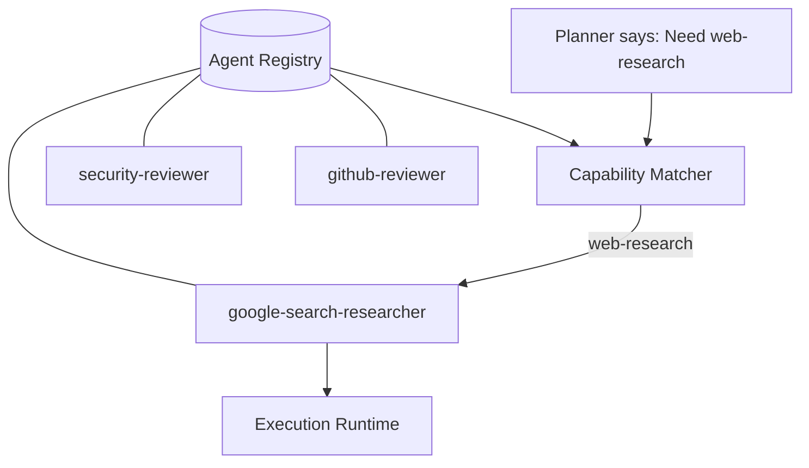

The planner does not directly choose `google-search-researcher`.

It requests `web-research`.

The runtime chooses the registered implementation.

---

# Built-In Agents

## GitHub Reviewer

Capabilities:

```text
code-review
bug-detection
```

Uses repository and pull request context to inspect changes and identify implementation issues.

---

## Security Reviewer

Capabilities:

```text
security-review
vulnerability-analysis
```

Analyzes repository or pull request changes from a security perspective.

---

## Google Search Researcher

Capabilities:

```text
web-research
information-retrieval
```

Implemented using Google's agent tooling and capable of performing external research.

---

# Google ADK Integration

Google ADK is one supported agent runtime inside Vigil.

It does **not** replace Vigil's orchestration layer.

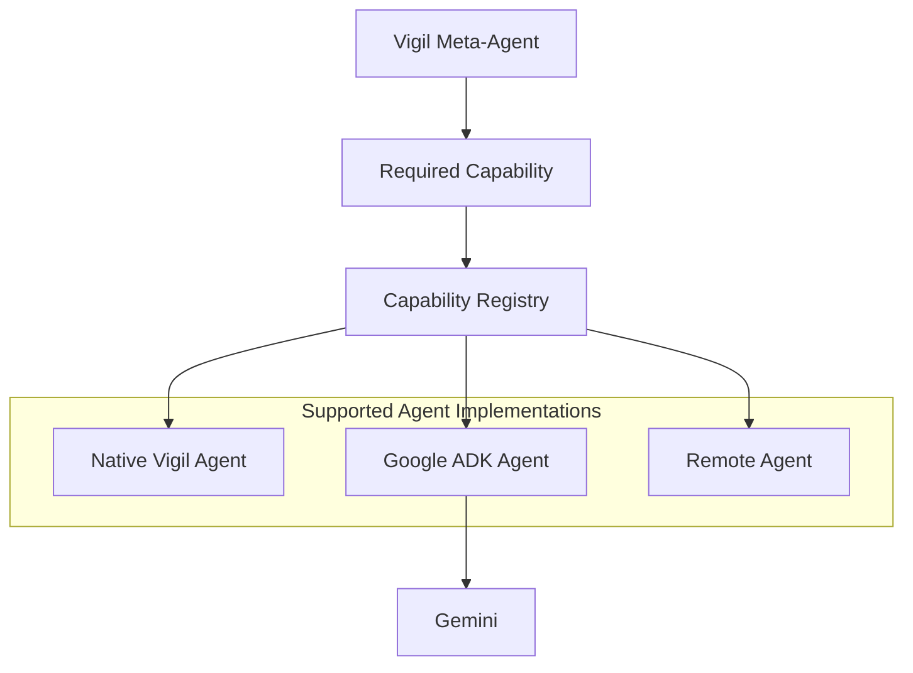

The architectural boundary is:

> **Vigil decides what the team should do. Google ADK helps an individual team member do its job.**

---

# Remote / Developer-Published Agents

Vigil supports agents that execute outside the main runtime.

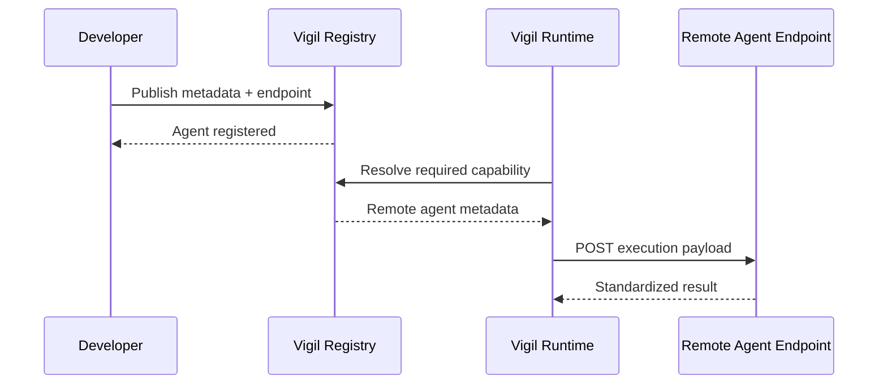

A remote endpoint follows a simple contract.

Success:

```json
{
  "success": true,
  "output": {}
}
```

Failure:

```json
{
  "success": false,
  "error": "Execution failed"
}
```

---

# Execution Runtime

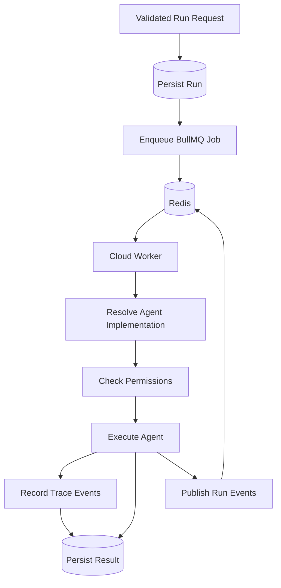

---

# Permissions

Agents declare the permissions they require.

Examples:

```text
repository:read
pull_requests:read
web.read
```

Unknown tools and permissions follow a default-deny approach.

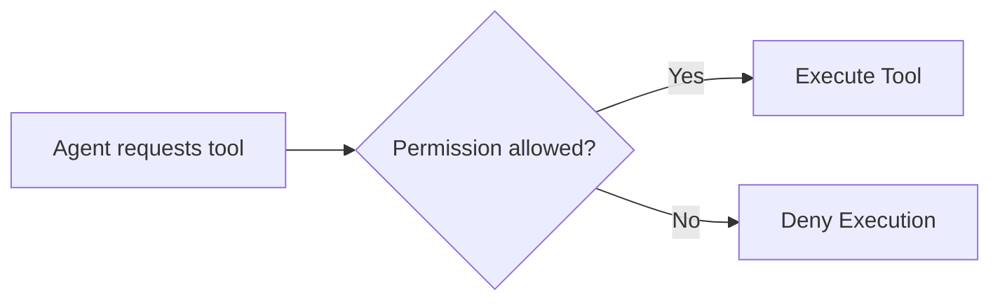

This creates a foundation for stronger policy enforcement as the platform evolves.

---

# Persistent Memory

Vigil persists orchestration state rather than keeping the entire reasoning loop only in process memory.

Stored state can include:

- current plan,
- previous iterations,
- completed capabilities,
- step results,
- evaluation outcomes,
- replanning decisions,
- reusable successful outputs,
- orchestration status.

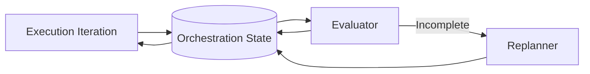

---

# Recovery

When a worker starts, Vigil checks for in-flight orchestrations and uses persisted state to recover interrupted execution.

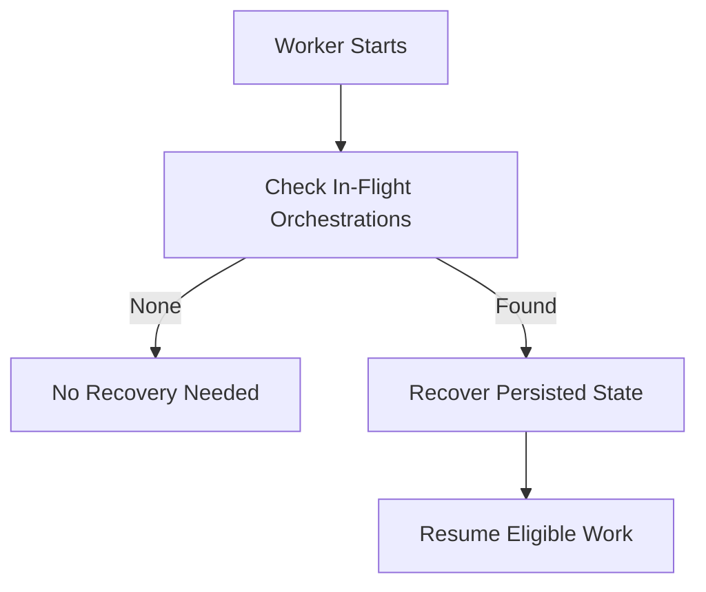

---

# Observability

Each run can produce structured trace events such as:

```text
Run created
Agent resolved
Tool invoked
LLM request started
LLM response received
Execution completed
```

Vigil records metrics such as:

- execution duration,
- token usage,
- estimated model cost,
- tool-call count,
- success/failure state,
- trace events,
- aggregate runtime statistics.

---

# Live Streaming

Execution events are streamed to the frontend using Server-Sent Events.

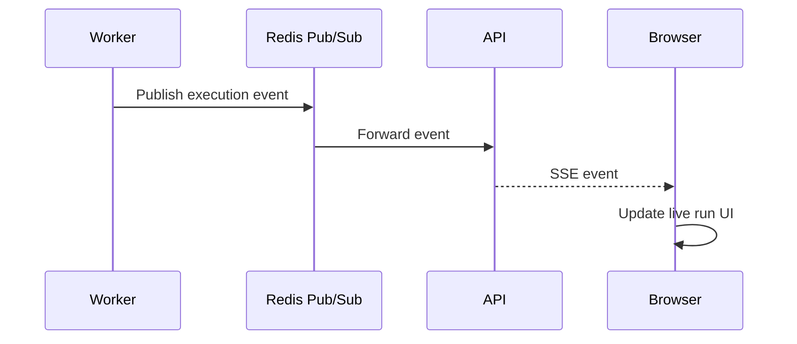

SSE is a good fit because Vigil primarily needs one-way server-to-browser execution updates.

---

# Authentication Flow

Vigil supports GitHub and Google authentication using Auth.js.

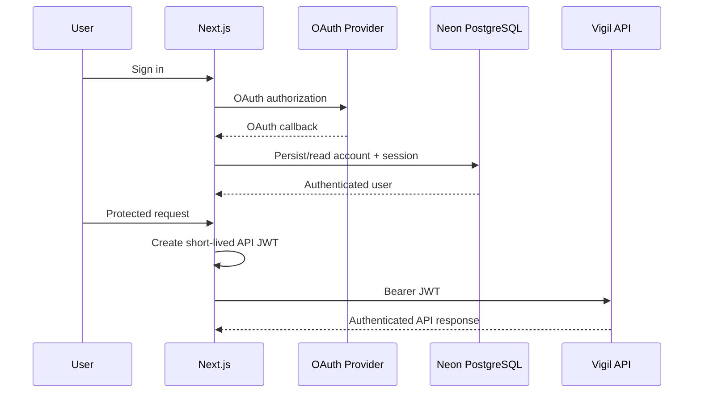

Developers can also generate persistent `vigil_` API keys for SDK usage.

---

# Data Model

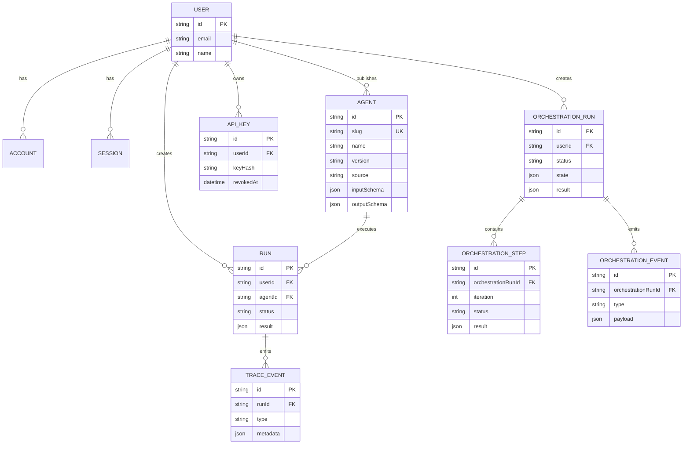

---

# API Overview

```http
GET  /api/v1/agents
GET  /api/v1/agents/mine
POST /api/v1/agents/publish

POST /api/v1/agents/:slug/runs

GET  /api/v1/runs
GET  /api/v1/runs/:runId

POST /api/v1/orchestrator
POST /api/v1/orchestrator/:orchestrationId/execute
GET  /api/v1/orchestrator/:orchestrationId

GET  /api/v1/metrics
```

---

# Vigil SDK

Install:

```bash
npm install @kaniska1/vigil-sdk
```

Create a client:

```ts
import { Vigil } from "@kaniska1/vigil-sdk";

const vigil = new Vigil({
  apiKey: process.env.VIGIL_API_KEY!,
});
```

List agents:

```ts
const agents = await vigil.agents.list();
```

Execute an agent:

```ts
const run = await vigil.runs.create(
  "github-reviewer",
  {
    repository: "owner/repository",
    pullRequest: 42,
  }
);
```

The SDK supports agent discovery, execution, orchestration, polling, streaming, published-agent management, and metrics.

---

# Tech Stack

| Layer | Technology |
|---|---|
| Frontend | Next.js 16, React 19, TypeScript |
| UI | Tailwind CSS, shadcn/ui |
| Authentication | Auth.js |
| Backend API | Node.js, Express, TypeScript |
| Database | PostgreSQL, Neon |
| ORM | Prisma |
| Queue | BullMQ |
| Redis | Upstash Redis |
| Streaming | Server-Sent Events |
| Agent Runtime | Vigil Runtime, Google ADK |
| Models | Gemini |
| Cloud Backend | Google Cloud Run |
| Background Execution | Google Cloud Run Worker Pools |
| Container Registry | Google Artifact Registry |
| Frontend Hosting | Vercel |
| SDK | `@kaniska1/vigil-sdk` |

---

# Deployment Architecture

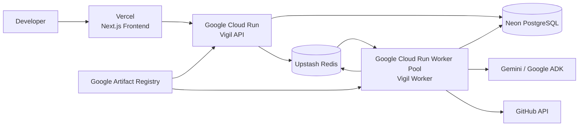

---

# Repository Structure

```text
vigil/
│
├── apps/
│   ├── api/                 # Express API, runtime, workers, orchestration
│   └── web/                 # Next.js frontend
│
├── packages/
│   └── db/                  # Prisma client and shared DB layer
│
├── scripts/                 # Setup / seed / utility scripts
│
├── Dockerfile
├── package.json
└── README.md
```

---

# Running Locally

## Requirements

- Node.js
- PostgreSQL
- Redis

Clone the repository:

```bash
git clone https://github.com/Kaniska1/vigil.git
cd vigil
```

Install dependencies:

```bash
npm install
```

Build the shared database package:

```bash
npm run build --workspace=@vigil/db
```

Configure environment variables:

```env
DATABASE_URL=
REDIS_URL=

VIGIL_API_SECRET=
VIGIL_API_KEY_ENCRYPTION_KEY=

GOOGLE_API_KEY=
GEMINI_API_KEY=

AUTH_SECRET=
AUTH_GITHUB_ID=
AUTH_GITHUB_SECRET=
AUTH_GOOGLE_ID=
AUTH_GOOGLE_SECRET=

NEXT_PUBLIC_API_URL=
```

Never commit production credentials.

Run the API:

```bash
npm run dev --workspace=@vigil/api
```

Run the background worker:

```bash
npm run dev:worker --workspace=@vigil/api
```

Run the frontend:

```bash
npm run dev --workspace=web
```

---

# Demo Flow

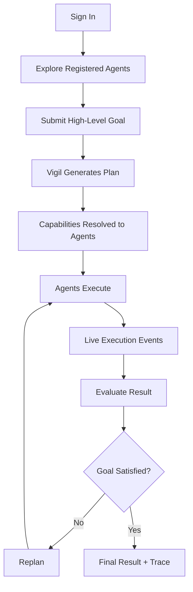

---

# Current Capabilities

Vigil currently supports:

- autonomous orchestration,
- capability-based planning,
- dynamic agent resolution,
- multi-step execution,
- dependency scheduling,
- persistent orchestration memory,
- semantic result evaluation,
- adaptive replanning,
- cross-iteration result reuse,
- execution recovery,
- BullMQ background jobs,
- Redis-backed coordination,
- SSE event streaming,
- agent permissions,
- execution tracing,
- token / latency / cost metrics,
- Google ADK agents,
- remote agent support,
- developer-published agents,
- API keys,
- JavaScript/TypeScript SDK,
- GitHub OAuth,
- Google OAuth,
- production deployment.

---

# What Makes Vigil Different?

Vigil is not just:

- a chatbot with multiple system prompts,
- a static preconfigured agent chain,
- an agent marketplace,
- or a thin wrapper around an LLM API.

Vigil treats agents as **dynamically discoverable computational capabilities**.

The agentic layer reasons about what needs to happen.

The runtime controls what is actually allowed to happen.

That separation gives Vigil a foundation for building agent systems that are more dynamic, observable, extensible, and operationally reliable.

---

# Future Direction

Vigil's architecture is designed to support future additions such as:

- agent quality scoring,
- cost-aware routing,
- latency-aware routing,
- automatic capability benchmarking,
- agent versioning,
- MCP integrations,
- A2A interoperability,
- human approval steps,
- execution replay,
- run comparison,
- richer evaluation systems,
- stronger enterprise policy enforcement,
- multi-tenant registries,
- adaptive agent selection.

The long-term vision is:

> **A package registry, execution runtime, SDK, and autonomous dependency resolver for AI agents.**

---

# Author

**Kaniska Mitra**

GitHub: [@Kaniska1](https://github.com/Kaniska1)

---

## License

MIT
